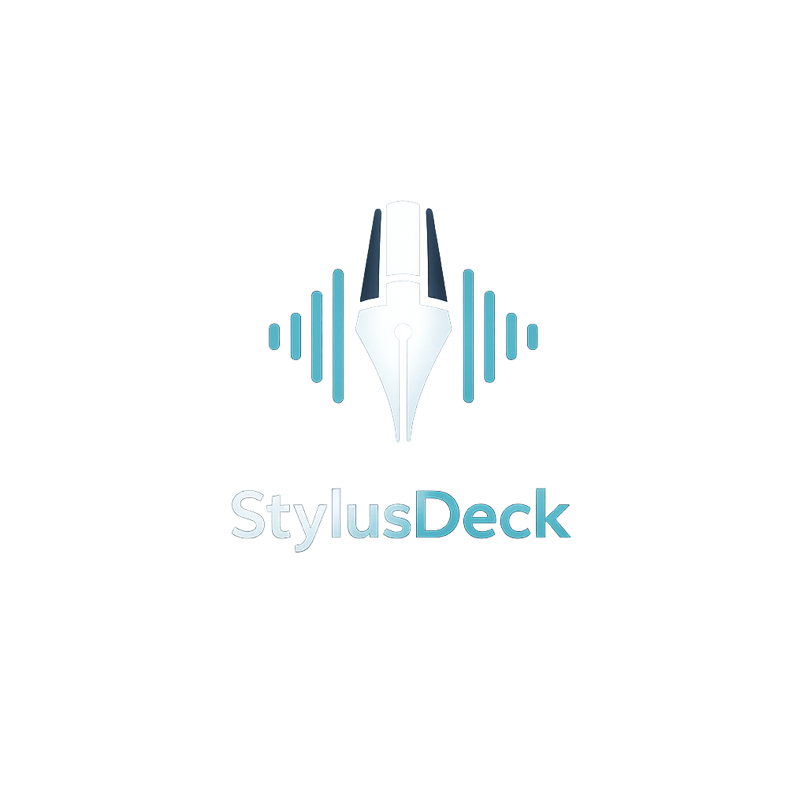
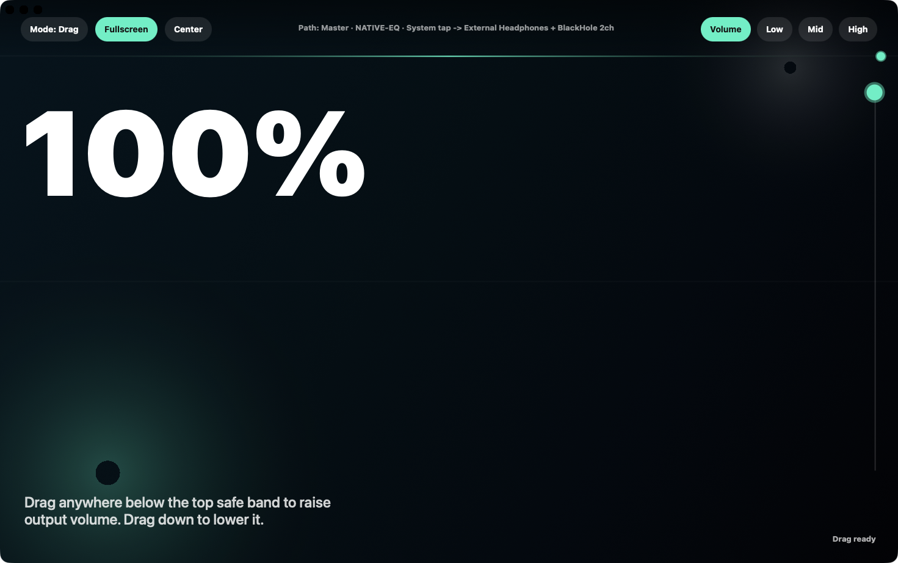
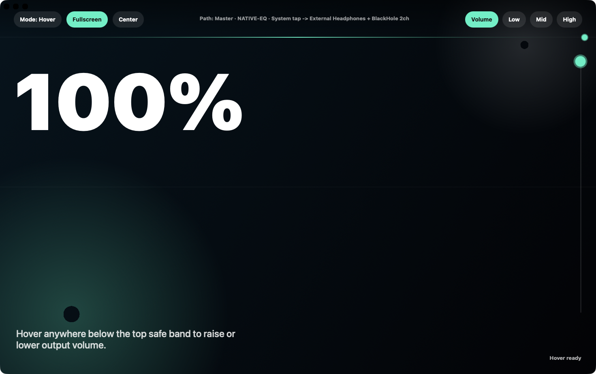
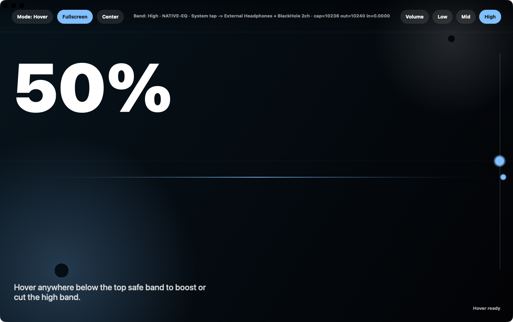

# StylusDeck

<p align="center">
  
</p>

<p align="center">
  Control your audio equalizers directly from a drawing tablet.
</p>

<p align="center">
  StylusDeck turns vertical pen movement into immediate, expressive control: drag the pen up and down to shape volume or EQ bands, or switch to Hover mode to adjust levels without pressing the pen down at all.
</p>

<p align="center">
  
</p>

## Screenshots

<p align="center">
  
  
</p>

## What It Is

StylusDeck is a macOS-native control surface for volume and three EQ bands:

- Volume
- Low
- Mid
- High

It is designed for drawing tablets, pen displays, and macro-driven setups where fast, absolute control matters more than tiny knobs or traditional mixer UI.

## Why It Feels Good To Use

- Absolute vertical control. Higher on the tablet means more; lower means less.
- Drag mode for deliberate, tactile movement.
- Hover mode for pressure-free adjustment with the pen floating above the surface.
- Native low-latency audio processing with live monitor output and OBS capture routing.
- Fullscreen-friendly layout built for large, uncluttered gestures.

## Quick Start

```bash
./start.sh
```

That single command will:

- verify macOS prerequisites
- install Homebrew if needed
- install `BlackHole 2ch` if needed
- build the native app and audio bridge binaries
- install `StylusDeck.app` into `~/Applications`
- print a readable setup report explaining what was installed, why it was needed, and how audio routing works
- launch the native `StylusDeck` app

If macOS prompts for Xcode Command Line Tools, finish that install and rerun `./start.sh`.

If `BlackHole 2ch` is installed for the first time and macOS has not activated it yet, reboot once and run `./start.sh` again.

After that first setup run, you can launch `StylusDeck.app` directly from Finder at `~/Applications/StylusDeck.app` instead of using the terminal command again.

## Audio Routing

While StylusDeck is running, it:

- taps live system audio
- applies the selected volume or EQ processing in real time
- sends the wet monitor signal to your real playback device, such as headphones or speakers
- mirrors that same wet signal to `BlackHole 2ch` for OBS

If macOS is currently set to use `BlackHole 2ch` as the live output device, StylusDeck temporarily redirects monitor playback back to a real output device while keeping `BlackHole 2ch` available for capture.

## Controls

- `1` switches to Volume
- `2` switches to Low
- `3` switches to Mid
- `4` switches to High
- `C` centers the current route at `50`
- `F` toggles fullscreen
- `Mode` switches between Drag and Hover

## Native App First

The native app is the primary experience:

```bash
./start.sh
```

or, after setup:

```bash
./scripts/run.sh
```

There is also an optional browser-based secondary UI:

```bash
./scripts/run-web.sh
```

## Requirements

- macOS
- Xcode Command Line Tools
- Homebrew
- `BlackHole 2ch`

The bootstrapper handles everything except the Apple-managed Xcode Command Line Tools prompt.

## OBS Setup

In OBS:

1. Add `Audio Input Capture`
2. Choose `BlackHole 2ch`

OBS will then receive the same processed signal that StylusDeck is sending to your headphones or speakers.

## Repo Layout

```text
.
|-- Sources/
|-- assets/screenshots/
|-- scripts/
|-- start.sh
|-- server.py
`-- web/
```

## Notes

- Keep the app running while you want live EQ and routing active.
- When the app exits normally, it tears down its temporary audio routing changes.
- The browser UI remains available, but the native app is the intended main path.
